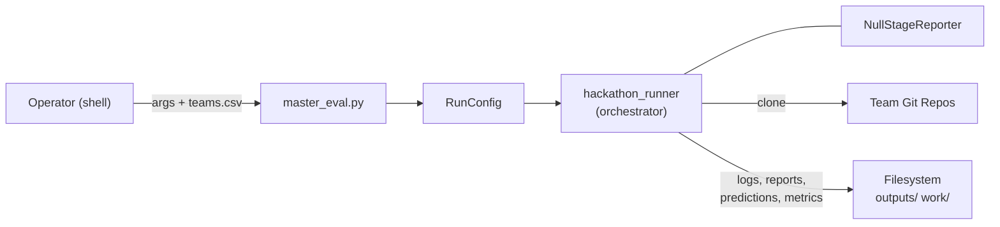
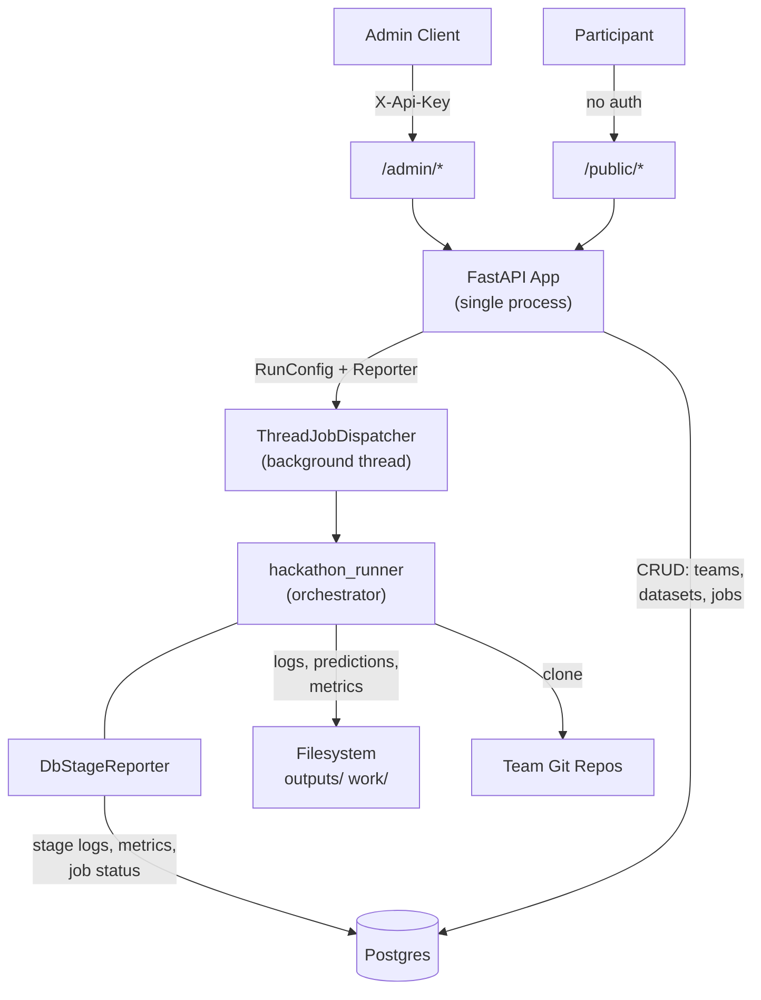
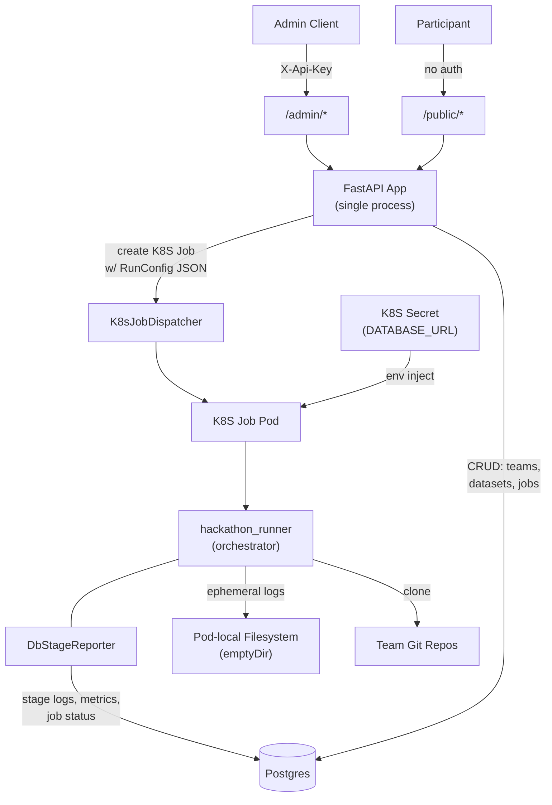
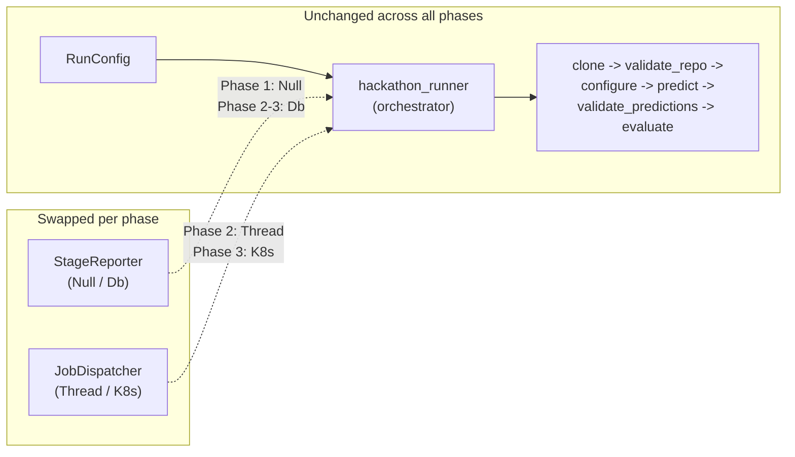

# Architecture

Three deployment phases — same runner core, progressively richer infrastructure.

---

## Phase 1 — CLI only

The operator runs `master_eval.py` directly. No database, no API. All state lives on the local filesystem.

**Key traits:**
- Single process, sequential team execution
- `NullStageReporter` — no DB writes, filesystem only
- Input: `teams.csv` + `datasets/*.csv` on disk
- Output: `outputs/<run_id>/` (logs, predictions, metrics, report.csv)

---

## Phase 2 — API + DB (current)

FastAPI wraps the same runner. Jobs execute in background threads. Stage progress is persisted to Postgres via `DbStageReporter`.

**Key traits:**
- Single FastAPI process, jobs in `threading.Thread`
- `DbStageReporter` writes per-stage progress to Postgres as it happens
- Dataset CSV content stored in Postgres (no file_path dependency)
- Filesystem outputs still written (but DB is the source of truth for status/metrics)

---

## Phase 3 — API + DB + K8S (future)

Only the dispatcher changes: `K8sJobDispatcher` creates a K8S Job pod instead of a local thread. The runner, reporter, DB schema, and API are identical to Phase 2.

**Key traits:**
- API process no longer runs eval workloads — just dispatches
- Each job gets its own pod (isolates CPU/memory/GPU per team)
- `discover_needs_gpu.py` drives node pool selection (GPU vs CPU) before pod creation
- Pod filesystem is ephemeral (emptyDir) — all durable state is in Postgres
- DB schema and API surface are unchanged from Phase 2

---

## What changes between phases

| Component | Phase 1 (CLI) | Phase 2 (API) | Phase 3 (K8S) |
|---|---|---|---|
| Entry point | `master_eval.py` | `POST /admin/jobs` | `POST /admin/jobs` |
| StageReporter | `NullStageReporter` | `DbStageReporter` | `DbStageReporter` |
| JobDispatcher | n/a | `ThreadJobDispatcher` | `K8sJobDispatcher` |
| Persistence | Filesystem only | Filesystem + Postgres | Postgres (pod FS ephemeral) |
| Runner location | Local process | Background thread | K8S pod |
